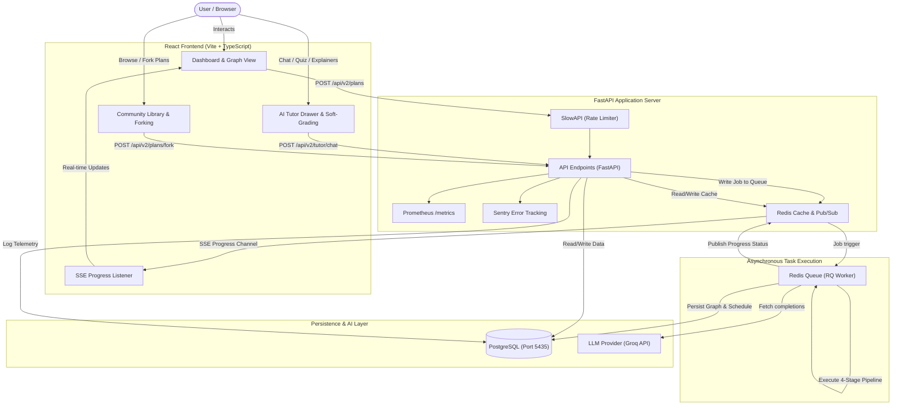

# 🌌 Conceptra: AI-Powered Learning Operating System

Conceptra is a next-generation **AI-Powered Learning Operating System** that converts unstructured syllabus documents (PDFs) or custom study topics into interactive, personalized, and adaptive study plans.

It generates an optimized **Concept Dependency Graph (DAG)**, maps a week-by-week **Topological Study Schedule** based on your exam date, generates **deep learning summaries and interactive quizzes**, provides a **context-aware AI Tutor with memory**, and supports a **Community Library for sharing and forking** curriculum roadmaps.

---

## 🏛️ System Architecture

Conceptra is built with a decoupled FastAPI backend, a responsive React frontend, and an asynchronous background worker architecture running locally.



---

## ✨ Features at a Glance

### 1. Multi-Stage Asynchronous AI Pipeline (RQ Worker)
* **Stage 1: Concept Extraction:** Extracts core concepts from your syllabus topic or text-based PDF.
* **Stage 2: Dependency Graphing:** Builds a clean Directed Acyclic Graph (DAG) representing concept prerequisites.
* **Stage 3: Topological Schedule Planner:** Calculates a customized week-by-week calendar based on constraints.
* **Stage 4: Explanation & Quiz Synthesis:** Automatically generates markdown summaries, study resources, and quizzes.

### 2. Conversational AI Tutor drawer with Memory (Phase 5)
* **Personalized Tutor:** Adapts to the student's mastery profile and focuses explanation detail dynamically.
* **Soft Grading API:** Evaluates open-ended answers with structured critique rather than binary scoring.
* **Edge Explainer Modal:** Explains *why* one concept is a prerequisite for another on graph edge click.
* **Weekly Performance Digest:** Summarizes student progress, lists frequent mistakes, and provides revision suggestions.
* **Visual Graph Animations:** Node confidence rings animate based on mastery; edges brighten when concepts are learned.

### 3. Community Knowledge sharing (Phase 4)
* **Library Board:** Browse user-published plans with search, sort, and tag filtering.
* **Forks/Clones:** Fork any public plan to make it your own; includes Clerk sign-in gates to protect user associations.
* **Searchable PDF Validator:** Real-time text-layer check on PDF syllabus uploads to reject image-only scans.

### 4. Telemetry, Analytics, & Observability (Phase 6)
* **API Usage Logs:** Tracks token counts, execution latencies, and generation costs per pipeline step.
* **Observability Dashboard:** Displays metrics on avg latency, cache hit ratios, token metrics, and API costs.
* **FastAPI Middleware:** SlowAPI rate limiting (`5/hour` on creation), Prometheus `/metrics` exporter, and Sentry middleware.

---

## 🛠️ Local Development Setup

Follow these instructions to run the entire stack locally.

### Prerequisites
* **Python:** version 3.10+
* **Node.js:** version 18+
* **PostgreSQL:** Running locally on port `5435`
* **Redis:** Running locally on port `6379`

---

### 1. Database Setup

Create a PostgreSQL database named `conceptra`.
```sql
CREATE DATABASE conceptra;
```

*(Note: If running PostgreSQL on a standard port or custom port, configure it inside backend `.env` accordingly).*

---

### 2. Backend Installation & Setup

1. Navigate to the `backend/` directory:
   ```bash
   cd backend
   ```
2. Create and activate a python virtual environment:
   ```bash
   python -m venv .venv
   source .venv/bin/activate
   # Windows: .venv\Scripts\activate
   ```
3. Install dependencies:
   ```bash
   pip install -r requirements.txt
   ```
4. Create a `.env` file in the `backend/` folder:
   ```env
   DATABASE_URL=postgresql+asyncpg://localhost:5435/conceptra
   REDIS_URL=redis://localhost:6379
   GROQ_API_KEY=your_groq_api_key_here
   SENTRY_DSN=optional_sentry_dsn_here
   CLERK_SECRET_KEY=your_clerk_secret_key
   NEXT_PUBLIC_CLERK_PUBLISHABLE_KEY=your_clerk_publishable_key
   ```
5. Apply database schema migrations:
   ```bash
   alembic upgrade head
   ```
6. Run the FastAPI development server:
   ```bash
   uvicorn app.main:app --reload --port 8000
   ```
   * The API runs at `http://127.0.0.1:8000`
   * API documentation is at `http://127.0.0.1:8000/docs`

---

### 3. Asynchronous Worker Setup

For background generation, you need to run the RQ worker.

1. Open a new terminal window/tab.
2. Navigate to the `backend/` directory and activate the virtual environment:
   ```bash
   cd backend
   ```
3. Run the worker script:
   ```bash
   python -m app.worker
   ```
   * The worker listens to the `default` Redis queue and processes LLM completions synchronously while pushing SSE progress streams.

---

### 4. Frontend Installation & Setup

1. Navigate to the `frontend/` directory:
   ```bash
   cd frontend
   ```
2. Install package dependencies:
   ```bash
   npm install
   ```
3. Create a `.env.local` file inside the `frontend/` folder:
   ```env
   VITE_API_VERSION=v2
   VITE_CLERK_PUBLISHABLE_KEY=your_clerk_publishable_key
   ```
4. Start the frontend Vite development server:
   ```bash
   npm run dev
   ```
   * The frontend runs at `http://localhost:5173`

---

## 📈 Monitoring & Telemetry

Conceptra compiles system logs and analytics natively:

1. **Benchmark Telemetry Dashboard:** Access `http://localhost:5173/benchmarks` to view LLM latencies, stages duration (extraction, scheduling, graph creation, content synth), token costs, and cache hit metrics.
2. **Prometheus Metrics:** Scrape system performance from `http://127.0.0.1:8000/metrics`.
3. **Sentry Dashboard:** Any unhandled FastAPI server-side exceptions will automatically pipe to Sentry for review.

---

## 🚀 Deployment Guide

To deploy this application to production platforms (FastAPI API server and RQ worker to **Railway**, Vite frontend to **Vercel**), refer to the detailed [Deployment Guide](file:///Users/srinivasch/Documents/Projects/Conceptra/deployment.md).
